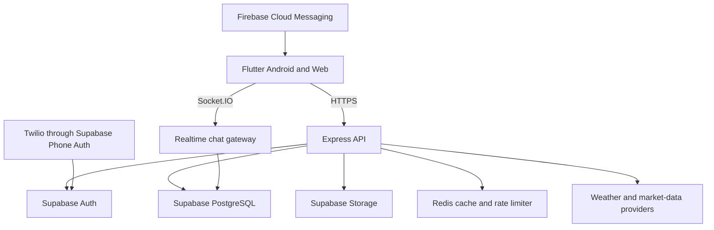

# Architecture overview



The Flutter project uses feature-first Clean Architecture:

```text
presentation → Riverpod controller → use case → repository → data source → API/storage
```

The backend uses validation at routes, authenticated role checks before service calls, and Supabase Row Level Security as a database-level protection layer.
